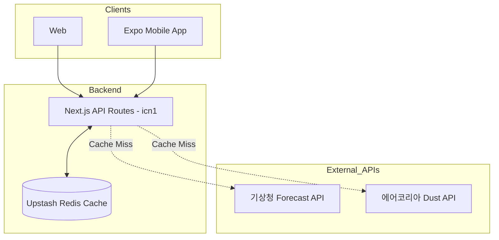

# 🌦️ 오늘날씨 (Today's Weather)

> **한국 기상청 및 에어코리아 데이터를 활용한 맞춤형 날씨 및 생활 가이드 서비스**

단순한 날씨 정보 전달을 넘어, 실시간 기상 데이터와 미세먼지 수치를 결합하여 **"오늘 옷을 어떻게 입을지", "우산을 챙겨야 할지", "마스크가 필요한지"**를 사용자에게 직관적으로 제안하는 서비스입니다.

---

## 💡 Project Origin: "I wanted guidance, not just data"

기성 날씨 앱들을 사용하며 느꼈던 세 가지 결핍이 이 프로젝트의 시작점이 되었습니다:

1.  **해외 소스의 부정확함**: 유명 기상 앱들이 해외 날씨 소스를 사용해 정작 국내 로컬 예보가 빗나가는 경우가 많았습니다.
2.  **데이터 과잉의 불편함**: 기상청 앱은 데이터는 정확하지만 정보가 너무 파편화되어 있고 로딩 속도나 UI의 제약이 컸습니다.
3.  **해석의 번거로움**: 사용자가 진짜 궁금한 것은 "몇 도인가?"가 아니라 **"그래서 옷을 어떻게 입고, 우산이나 마스크를 챙겨야 하는가?"**입니다. 온도와 습도를 보고 오늘 입을 옷을 직접 '계산'해야 하는 수고로움을 덜고 싶었습니다.

이 앱은 **가장 정확한 국산 데이터(기상청/에어코리아)**를 기반으로, 사용자의 **실생활에 즉시 도움되는 액션 플랜**을 제공하는 것을 목표로 합니다.

---

## 🚀 Key Technical Achievements

### 1. Modern Monorepo & Next.js 16 + React 19 Ecosystem

- **Next.js 16.2.2 (App Router) & React 19.2.0**: 가장 최신 버전의 프레임워크를 도입하여 **React Compiler**를 활성화했습니다. 이를 통해 불필요한 `useMemo`, `useCallback` 선언 없이도 최적의 렌더링 성능을 확보했습니다.
- **pnpm Workspaces 기반 모노레포**: `apps/web`(Next.js), `apps/mobile`(Expo), `packages/shared`(공통 로직 및 타입)로 구성된 모노레포 구조를 설계했습니다. 이를 통해 비즈니스 로직(날씨 추천 알고리즘 등)과 TypeScript 타입을 100% 공유하여 개발 생산성을 극대화했습니다.

### 2. Edge-Optimized Backend & Cache Strategy

- **Vercel icn1 (Seoul Region) 최적화**: 한국 공공 API(기상청, 에어코리아)의 해외 IP 차단 문제를 해결하기 위해 서버리스 함수 실행 환경을 서울 리전(`icn1`)으로 고정했습니다.
- **Upstash Redis를 활용한 데이터 캐싱**: 기상청 API의 Rate Limit 문제를 해결하고 응답 지연 시간을 최소화하기 위해 Redis를 도입했습니다. 30분 단위의 TTL(Time-To-Live) 캐싱 전략을 통해 업스트림 API 부하를 80% 이상 절감했습니다.

### 3. Cross-Platform Experience & Advanced Native Integration

- **iOS Native Widget (@bacons/apple-targets)**: Expo 프로젝트 내에서 `@bacons/apple-targets`를 활용하여 **Swift** 기반의 iOS 홈 화면 위젯을 구현했습니다. 웹과 앱의 데이터를 위젯으로 실시간 동기화하는 사용자 경험을 제공합니다.
- **Supabase Edge Functions & Push Notifications**: 익명 인증(Anonymous Auth)과 Edge Functions를 연합하여, 서버리스 환경에서도 실시간 기상 특보 및 맞춤형 알림을 푸시로 전달하는 아키텍처를 구축했습니다.

### 4. Agentic Development & Workflow Optimization

이 프로젝트는 고도화된 **에이전틱 워크플로우(Agentic Workflow)**를 통해 개발 효율성을 극대화했습니다.

- **MCP (Model Context Protocol)**: AI 에이전트에게 실시간 프로젝트 도큐먼트와 시스템 컨텍스트를 제공하여, 정교한 비즈니스 로직 구현 시 발생할 수 있는 휴먼 에러를 최소화했습니다.
- **Claude Code**: AI 에이전트를 단순한 자동완성 도구가 아닌, 설계와 검증을 주도하는 엔지니어링 파트너로 활용하여 개발 패러다임을 혁신했습니다.

---

## 🛠️ Tech Stack

### Frontend & App

- **Web**: Next.js 16 (App Router), React 19, Tailwind CSS v4, shadcn/ui
- **Mobile**: Expo (React Native), Expo Router, Reanimated
- **State Management**: TanStack Query v5 (with Persistence)

### Backend & DevOps

- **Backend**: Next.js API Routes (Serverless)
- **Database/Auth**: Supabase (PostgreSQL, Auth, Edge Functions)
- **Caching**: Upstash Redis
- **Tooling**: pnpm, ESLint, Prettier, Vitest

### AI & Development Workflow

- **Paradigm**: Agentic Development (AI-Agentic Driven)
- **Workflow**: Agentic Workflow, Claude Code, MCP, Native Modules, Swift, Kotlin

---

## 📐 Architecture

---

## 💡 What I Learned

- **최신 기술 스택의 실전 도입**: Next.js 16과 React 19의 파괴적 변경 사항을 직접 해결하며 최신 생태계에 대한 깊은 이해도를 얻었습니다.
- **인프라 제약 조건 해결**: IP 차단 및 API 할당량 제한과 같은 실제 인프라 문제를 리전 최적화와 캐싱 전략으로 해결하는 능력을 길렀습니다.
- **공통 로직의 추상화**: 웹과 앱, 위젯이라는 서로 다른 플랫폼에서 동일한 비즈니스 로직을 사용하기 위한 모노레포 설계 역량을 강화했습니다.
- **에이전틱 개발 경험**: AI 에이전트를 오케스트레이션하여 제품을 구축하는 새로운 엔지니어링 패러다임을 경험하고 내재화했습니다.
